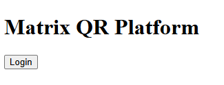
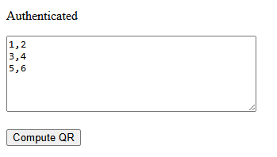
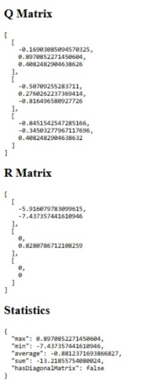

# Matrix QR Decomposition Platform

A full-stack multi-service application built with Go, Node.js, TypeScript, and React that performs QR matrix decomposition, computes matrix statistics, secures endpoints with JWT authentication, and runs locally, through Docker Compose, or in the cloud on Render.

---

## Live Demo

### Frontend

https://matrix-app-frontend-d5fi.onrender.com

### Go API

https://matrix-app-go-api.onrender.com

### Node API

https://matrix-app-node-api.onrender.com

### Demo Authentication

The frontend uses a predefined demo account when the **Login** button is clicked.

For direct API testing:

```json
{
  "username": "admin",
  "password": "admin123"
}
```

---

## Screenshots

### Landing Page

The application entry point displaying the platform title and authentication action.



### Matrix Input

After authentication, users can enter matrix values and submit them for QR decomposition.



### QR Decomposition Results

Displays the computed Q matrix, R matrix, and generated statistical analysis returned by the distributed backend services.



---

## Overview

This project demonstrates a distributed architecture composed of three layers:

- A **React frontend** provides authentication and matrix input.
- A **Go API (Fiber)** validates matrices, performs QR decomposition using Gonum, and coordinates the workflow.
- A **Node.js API (Express + TypeScript)** calculates statistical information from the decomposition results.

Services communicate through HTTP, protected endpoints use JWT authentication, and Docker Compose orchestrates the complete environment.

---

## Architecture

```text
React Frontend
      │
      ▼
Go API (Fiber)
      │
      ├── JWT Authentication
      ├── Matrix Validation
      ├── QR Decomposition (Gonum)
      │
      ▼
Node API (Express + TypeScript)
      │
      ├── Statistics Calculation
      ├── Matrix Analysis
      │
      ▼
Combined Response
```

---

## Tech Stack

### Frontend

- React
- TypeScript
- Vite

### Go Service

- Go
- Fiber
- Gonum
- JWT

### Node Service

- Node.js
- TypeScript
- Express

### Infrastructure

- Docker
- Docker Compose
- Render

---

## Features

### Frontend

- Browser-based interface
- JWT authentication
- Matrix input editor
- QR decomposition visualization
- Statistics visualization

### Authentication

- JWT token generation
- Protected QR decomposition endpoint
- Middleware-based authorization

### Matrix Validation

The API validates:

- Empty matrices
- Empty rows
- Non-rectangular matrices

### QR Decomposition

Uses Gonum to calculate:

- Q matrix
- R matrix

### Statistics

The Node service calculates:

- Maximum value
- Minimum value
- Sum
- Average
- Diagonal matrix detection

### Dockerized Deployment

All services run inside Docker containers and communicate through Docker networking.

---

## Deployment

All services are deployed on Render.

| Service  | URL                                           |
| -------- | --------------------------------------------- |
| Frontend | https://matrix-app-frontend-d5fi.onrender.com |
| Go API   | https://matrix-app-go-api.onrender.com        |
| Node API | https://matrix-app-node-api.onrender.com      |

The Go API communicates with the Node API through:

```text
STATISTICS_API_URL=https://matrix-app-node-api.onrender.com/api/statistics
```

---

## Project Structure

```text
matrix-app/
│
├── frontend/
│   ├── src/
│   │   ├── components/
│   │   ├── services/
│   │   ├── types/
│   │   ├── App.tsx
│   │   └── main.tsx
│   ├── package.json
│   └── vite.config.ts
│
├── go-api/
│   ├── cmd/
│   ├── handlers/
│   ├── middleware/
│   ├── models/
│   ├── services/
│   ├── integration/
│   ├── Dockerfile
│   └── go.mod
│
├── node-api/
│   ├── src/
│   │   ├── controllers/
│   │   ├── services/
│   │   ├── types/
│   │   └── services/statistics.service.test.ts
│   ├── Dockerfile
│   ├── jest.config.js
│   └── package.json
│
├── docker-compose.yml
│
└── README.md
```

---

## Running with Docker

### Prerequisites

Install:

- Docker Desktop

### Build and Start

From the project root:

```bash
docker compose up --build
```

### Services

| Service  | URL                   |
| -------- | --------------------- |
| Frontend | http://localhost:5173 |
| Go API   | http://localhost:8080 |
| Node API | http://localhost:3000 |

---

## Local Development

### Frontend

```bash
cd frontend
npm install
npm run dev
```

Frontend:

```text
http://localhost:5173
```

### Go API

```bash
cd go-api
go run ./cmd
```

Go API:

```text
http://localhost:8080
```

### Node API

```bash
cd node-api
npm install
npm run dev
```

Node API:

```text
http://localhost:3000
```

---

## Testing

### Go Unit and Integration Tests

```bash
cd go-api
go test ./...
```

Coverage:

```bash
go test ./... -cover
```

### Node Unit Tests

```bash
cd node-api
npm test
```

Current Node test coverage includes:

- Statistics calculation
- Diagonal matrix detection
- Negative value handling
- Aggregate calculations

### Integration Workflow Tested

The integration suite validates:

```text
Login
  ↓
JWT Generation
  ↓
Protected Endpoint Access
  ↓
QR Decomposition
  ↓
Go → Node Communication
  ↓
Statistics Generation
  ↓
Combined Response
```

---

## API Flow

```text
React Frontend
        │
        ▼
POST /login
        │
        ▼
   JWT Token
        │
        ▼
POST /api/qr
        │
        ▼
JWT Middleware
        │
        ▼
Matrix Validation
        │
        ▼
QR Decomposition
        │
        ▼
Node Statistics API
        │
        ▼
Combined Response
        │
        ▼
Frontend Visualization
```

---
